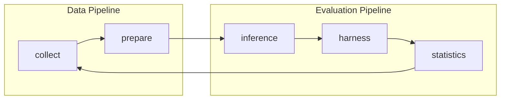

<p align="center">
    
</p>

<div align="center">

 [English](https://github.com/menik1126/Swing-Bench/) 

</div>


<p align="center">
Code and data for our paper <a href="https://arxiv.org/abs/2505.23932">SwingArena: Competitive Programming Arena for Long-context GitHub Issue Solving</a>
    </br>
    </br>
    <a href="https://www.python.org/">
        
    </a>
    <a href="https://copyright.princeton.edu/policy">
        
    </a>
</p>

Please refer our [website](https://swing-bench.github.io/) for the public leaderboard.

## 📰 News

* **[June. 5, 2024]**: We have released [SwingArena](https://arxiv.org/abs/2505.23932)! 

## 👋 Overview
SwingArena is a realistic, *CI-driven* evaluation framework for LLMs that simulates real-world software development by pairing models as patch *submitters* and *reviewers*, enhanced with *retrieval-augmented code generation* for multi-language support and long-context handling.


## 🛠️ Technical Architecture & Environment Setup

SwingArena employs an advanced containerized evaluation architecture that ensures cross-platform reproducibility and consistency. The system core relies on **Docker** for isolated environment management, combined with **CI tools** (such as GitHub Actions simulated through `act`) to achieve real-world software development workflow evaluation.

### 🏗️ Architecture & Module Overview

SwingArena consists of five core modules that work together to create a complete software engineering benchmark pipeline:

#### 📊 Module Workflow



#### 🔧 Core Modules

##### 📥 **collect** - Data Collection & Mining
- **Purpose**: Mine and filter high-quality GitHub repositories and pull requests
- **Key Functions**: Repository selection from top PyPI packages, PR collection with CI test validation, LLM-based quality filtering, expert rule-based validation
- **Outputs**: Task instances with issues, patches, and test cases

##### 🛠️ **prepare** - Data Preparation & Indexing  
- **Purpose**: Process and index collected data for efficient retrieval
- **Key Functions**: Repository cloning and management, BM25 search index construction, multi-stage quality filtering (CI, annotation, content), dataset validation and testing
- **Integration**: Builds indexes used by `inference` for context-aware generation

##### 🤖 **inference** - Model Inference Engine
- **Purpose**: Generate patches and solutions using various AI models
- **Key Functions**: API model support (OpenAI, Anthropic, Claude), local Llama model inference, live GitHub issue solving, retrieval-augmented code generation
- **Integration**: Uses prepared datasets and indexes from `prepare`

##### ⚔️ **harness** - Evaluation Framework
- **Purpose**: Evaluate model performance through CI-driven testing
- **Key Functions**: Dual-agent battle mode (patch submitter vs reviewer), CI workflow simulation, patch and test validation, Docker-based isolated execution
- **Integration**: Validates patches through real CI environments, similar to `collect` filtering

##### 📈 **statistics** - Analysis & Reporting
- **Purpose**: Analyze results and provide insights for dataset improvement
- **Key Functions**: Performance metric analysis, difficulty and clarity assessment, token usage and cost tracking, dataset quality reporting
- **Integration**: Provides feedback to improve `collect` filtering criteria (quality loop)

### 🔧 System Requirements
Before getting started, please ensure your system meets the following requirements:
- **Docker**: Follow the [Docker official installation guide](https://docs.docker.com/engine/install/) to install Docker Engine. Linux users are recommended to refer to the [post-installation steps](https://docs.docker.com/engine/install/linux-postinstall/) for optimal experience.
- **Hardware Configuration**: Recommended `x86_64` architecture machine with at least 120GB available storage, 16GB RAM, and 8 CPU cores (`arm64` support is still experimental)
- **Python Environment**: Python 3.8+ and related dependency packages

### 🏗️ Core Technology Stack
SwingArena integrates multiple cutting-edge technologies:

**AI Model Integration**: Supports various large language model APIs (OpenAI, Anthropic, Claude, etc.) and local model serving through a flexible model proxy system for seamless switching.

**Retrieval-Augmented Generation**: Built-in BM25 retriever provides precise relevant information retrieval for long-context code generation, supporting multi-language codebase indexing (Python, Rust, C++, Go, JavaScript, TypeScript, PHP, etc.).

**Distributed Evaluation**: Adopts multi-process parallel evaluation architecture with Modal cloud execution support, dynamically adjusting worker processes based on system resources (recommended not to exceed `min(0.75 * os.cpu_count(), 24)`).

**Arena Mechanism**: Pioneering dual-agent battle evaluation mode where one agent acts as a patch submitter and another as a code reviewer, simulating real collaborative development scenarios.

**Data Processing Pipeline**: Complete data collection, annotation, and evaluation pipeline with automated GitHub repository issue collection and PR analysis, multi-round annotation quality control, CI-driven validation, and detailed performance metrics analysis.

## 🚀 Quick Start

To build SwingArena from source, follow these steps:

### 🔧 Basic Installation
```bash
git clone https://github.com/menik1126/Swing-Bench.git
cd Swing-Bench
pip install -e .
```

### 🛠️ Full Installation with CI Tools (Recommended)
For complete SwingArena functionality including agent battles and CI simulation:
```bash
pip install -e ".[ci-tools]"
```

This enhanced installation will automatically:
- ✅ Install all Python dependencies 
- 🐳 **Install Docker** (on supported Linux distributions)
- 🔧 **Install `act`** (GitHub Actions local runner)
- 📦 Install Docker SDK for Python and YAML parser
- 🔗 Set up pre-commit hooks

> **💡 Note**: The basic `pip install -e .` only installs Python dependencies. For CI-driven evaluation and agent battles, the `[ci-tools]` installation is required.

### ☕ Java Requirements for BM25 Retrieval

If you plan to use BM25 retrieval for code search (used by the `prepare` and `inference` modules), you'll need Java 21+:

**Installation:**
```bash
# Using conda (recommended)
conda install openjdk=21

# Set environment variables (add to ~/.bashrc or ~/.zshrc)
export JVM_PATH=$CONDA_PREFIX/lib/jvm/lib/server/libjvm.so
export LD_LIBRARY_PATH=$CONDA_PREFIX/lib/jvm/lib/server:$LD_LIBRARY_PATH
```

**Alternative installation methods:**
- **Ubuntu/Debian**: `sudo apt-get install openjdk-21-jdk`
- **macOS**: `brew install openjdk@21`
- **Windows**: Download from [Adoptium](https://adoptium.net/) or use `choco install openjdk21`

> **💡 Note**: Java is required for the `pyserini` library used in BM25 indexing and retrieval. Without it, you can still use other SwingArena features but won't be able to build search indexes or use retrieval-augmented generation.

### 🔧 CI Tools Installation Details

**Prerequisites:**
- **Git** (required for repository operations)
- **Docker** (required for act to run GitHub Actions and containerized environments)
- **sudo/admin privileges** (for system-level tool installation)

**Alternative Installation Methods:**

If the automatic installation doesn't work, use the dedicated installer:
```bash
python install_ci_tools.py
```

**Manual Installation (if automatic fails):**

*Docker Installation:*
- **Linux (Ubuntu/Debian)**:
  ```bash
  curl -fsSL https://get.docker.com -o get-docker.sh
  sudo sh get-docker.sh
  sudo usermod -aG docker $USER
  ```
- **Linux (CentOS/RHEL)**:
  ```bash
  sudo yum install -y yum-utils
  sudo yum-config-manager --add-repo https://download.docker.com/linux/centos/docker-ce.repo
  sudo yum install -y docker-ce docker-ce-cli containerd.io
  sudo systemctl start docker && sudo systemctl enable docker
  sudo usermod -aG docker $USER
  ```
- **macOS**: [Download Docker Desktop](https://docs.docker.com/desktop/mac/install/) or `brew install --cask docker`
- **Windows**: [Download Docker Desktop](https://docs.docker.com/desktop/windows/install/) or use Chocolatey/winget

*act Installation:*
- **Linux**: `curl -s https://raw.githubusercontent.com/nektos/act/master/install.sh | sudo bash`
- **macOS**: `brew install act`
- **Windows**: `choco install act-cli` or `winget install nektos.act`

### ✅ Installation Verification

Verify CI tools installation:
```bash
python install_ci_tools.py --check
```

Expected output after successful CI tools installation:
```
🔍 Checking CI tools installation status...

act (GitHub Actions): ✅ Installed
Docker: ✅ Installed
Git: ✅ Installed
Python docker: ✅ Installed
Python yaml: ✅ Installed

📊 Overall status: ✅ All tools ready
```

## 📊 Dataset Access

SwingArena automatically downloads datasets from Hugging Face when needed. You can also load them manually:

```python
from datasets import load_dataset

# Load the main SwingBench dataset
dataset = load_dataset('SwingBench/SwingBench', split='test')

# Or load language-specific datasets
languages = ['rust', 'cpp', 'python', 'go', 'java', 'javascript', 'php']
swingbench = {}
for lang in languages:
    swingbench[lang] = load_dataset('SwingBench/SwingBench-data', split=lang)
```

## 🎯 First Run: Verify Your Setup

Now let's run a simple evaluation to verify everything works:

> **⚠️ Important Prerequisites:**
> - **Docker must be running** (check with `docker ps`)
> - This command will **automatically download** the dataset from Hugging Face (~500MB)
> - It will **build Docker images** and **run CI tests** (may take 5-10 minutes first time)

```bash
python -m swingarena.harness.run_evaluation \
    --predictions_path gold \
    --concurrent_workers 1 \
    --instance_ids tokio-rs__tokio-6978
```

**What this does:**
1. Downloads `tokio-rs__tokio-6978` instance from SwingBench dataset
2. Builds a Docker container with the repository environment
3. Applies the gold patch (the correct fix)
4. Runs CI tests to verify the patch works

**Expected output:**
```
Loading dataset...
Building Docker images...
Running evaluation...
✅ Test passed: tokio-rs__tokio-6978
```

If successful, you're ready to use SwingArena! 🎉

## 💽 Basic Usage

### Running Evaluations

Evaluate model predictions on SwingArena using the evaluation harness:

```bash
python -m swingarena.harness.run_evaluation \
    --dataset_name SwingBench/SwingBench \
    --predictions_path <path_to_predictions> \
    --concurrent_workers <num_workers>
    # use --predictions_path 'gold' to verify the gold patches
```

**Key Parameters:**
- `--dataset_name`: Dataset to use (default: SwingBench/SwingBench)
- `--predictions_path`: Path to predictions file, or 'gold' for gold patches
- `--concurrent_workers`: Number of parallel workers (recommended: `min(0.75 * os.cpu_count(), 24)`)
- `--instance_ids`: Specific instance IDs to evaluate (space-separated)
- `--timeout`: Timeout in seconds for each instance (default: 600)

**Output:**
This command generates:
- Docker build logs in `logs/build_images/`
- Evaluation logs in `logs/run_evaluation/`
- Final results in `evaluation_results/`

To see all available options:
```bash
python -m swingarena.harness.run_evaluation --help
```

> [!WARNING]
> **Resource Requirements**
> - Recommended: `x86_64` machine with at least 120GB free storage, 16GB RAM, 8 CPU cores
> - For Docker Desktop: Increase virtual disk space to ~120GB
> - Adjust `--concurrent_workers` based on available resources
> - `arm64` support is experimental

### Using SwingArena for Model Development

The SwingArena repository can help you:
* Train your own models on our pre-processed datasets
* Run [inference](https://github.com/menik1126/Swing-Bench/blob/main/swingarena/inference/README.md) on existing models (local models like LLaMA, or API models like GPT-4)
* Run SwingArena's [data collection procedure](https://github.com/menik1126/Swing-Bench/blob/main/swingarena/collect/) on your own repositories

## 🚀 Advanced Features

### 🥊 Arena Battle Mode

SwingArena's dual-agent battle evaluation mode allows you to compare two AI models in a competitive programming environment.

**Prerequisites:**
Before running Arena Battle, you need to set up the workspace:

1. **Create workspace directories:**
```bash
mkdir -p /path/to/testbed /path/to/repos /path/to/indexes
```

2. **Set environment variables:**
```bash
export SWING_TESTBED_PATH="/path/to/testbed"         # Temporary work directory
export SWING_REPOS_DIR_PATH="/path/to/repos"         # Repository storage (see preparation below)
export SWING_INDEXES_PATH="/path/to/indexes"         # BM25 indexes (see preparation below)
export CI_TOOL_NAME=act
```

3. **Prepare repositories and indexes** (required for retrieval-augmented generation):
```bash
# Clone repositories
cd swingarena/prepare
python swing_clone_repos.py \
    --dataset_path SwingBench/SwingBench \
    --repo_root_dir $SWING_REPOS_DIR_PATH

# Build BM25 indexes (requires Java 21+)
python swing_build_index.py \
    --dataset_path SwingBench/SwingBench \
    --repo_root_dir $SWING_REPOS_DIR_PATH \
    --output_dir $SWING_INDEXES_PATH
```

**Running a Battle:**
```bash
python swingarena/harness/agent_battle.py \
    --ci_tool_name act \
    --dataset_name SwingBench/SwingBench \
    --language rust \
    --model_lhs "gpt-4" \
    --model_rhs "claude-3" \
    --api_key_lhs "your-api-key-1" \
    --api_key_rhs "your-api-key-2"
```

**Battle Parameters:**
- `--model_lhs/rhs`: Left/Right side AI models (e.g., "gpt-4", "claude-3")
- `--api_key_lhs/rhs`: API keys for the respective models
- `--base_url_lhs/rhs`: Custom API endpoints (optional)
- `--language`: Programming language (rust, python, go, etc.)
- `--split`: Dataset split (optional)
- `--turns`: Number of battle turns (default: 1)
- `--ci_tool_name`: CI tool to use (default: "act")

**Using the Battle Script:**
```bash
# Edit environment variables in the script, then run:
./scripts/examples/battle_template.sh
```

### 🌩️ Cloud Evaluation with Modal

Run evaluations on the cloud using [Modal](https://modal.com/) to avoid local setup:

```bash
# Note: Modal evaluation requires using the modal_eval module
python -m swingarena.harness.modal_eval.run_evaluation_modal \
    --predictions_path gold \
    --instance_ids tokio-rs__tokio-6978
```

> [!NOTE]
> Modal for SwingArena is currently experimental and may not be fully supported.

### 🔄 Complete Workflow: Custom Dataset Creation

For advanced users who want to create their own SwingArena-style datasets:

#### 1. **Data Collection** (`collect`)
Mine repositories and create task instances:
```bash
cd swingarena/collect
./run_get_tasks_pipeline.sh
```

#### 2. **Data Preparation** (`prepare`)
Process and index datasets:
```bash
cd swingarena/prepare

# Clone repositories from task instances
python swing_clone_repos.py \
    --dataset_path /path/to/task-instances.jsonl \
    --repo_root_dir /path/to/repos

# Build BM25 search index
python swing_build_index.py \
    --dataset_path /path/to/task-instances.jsonl \
    --repo_root_dir /path/to/repos \
    --output_dir /path/to/indexes \
    --sub_dataset_identifier Python
```

#### 3. **Model Inference** (`inference`)
Generate solutions with AI models:
```bash
cd swingarena/inference

# Using API models (OpenAI, Anthropic, etc.)
python -m swingarena.inference.run_api \
    --dataset_name_or_path /path/to/task-instances.jsonl \
    --split test \
    --model_name_or_path gpt-4 \
    --output_dir /path/to/output \
    --max_cost 1.0

# Or using local Llama models
python -m swingarena.inference.run_llama \
    --dataset_name_or_path /path/to/task-instances.jsonl \
    --model_name_or_path /path/to/llama-model \
    --output_dir /path/to/output
```

#### 4. **Evaluation** (`harness`)
Test with CI-driven evaluation:
```bash
cd swingarena/harness
python -m swingarena.harness.run_evaluation --predictions_path ./results
```

#### 5. **Analysis** (`statistics`)
Generate insights and reports:
```bash
cd swingarena/statistics
python arena_stats.py --arena_log_dir ./evaluations
```

## 🍎 Tutorials
We've also written the following blog posts on how to use different parts of SwingBench.
If you'd like to see a post about a particular topic, please let us know via an issue.
* [Nov 1. 2023] Collecting Evaluation Tasks for SwingArena ([🔗](https://github.com/menik1126/Swing-Bench/blob/main/swingarena/collect/README.md))


## 🚨 Troubleshooting

### Common CI Tool Issues

**1. "act: command not found"**
- Ensure `/usr/local/bin` is in your PATH
- Reinstall: `python install_ci_tools.py --force`

**2. "Docker daemon not running"**
- Start Docker service: `sudo systemctl start docker` (Linux)
- Start Docker Desktop (macOS/Windows)

**3. Permission denied errors**
- Add user to docker group: `sudo usermod -aG docker $USER`
- Log out and back in

For detailed troubleshooting, see [CI_TOOLS_SETUP.md](CI_TOOLS_SETUP.md).

## ✍️ Citation
If you find our work helpful, please use the following citations.
```
@article{xu2025swingarena,
  title={SwingArena: Competitive Programming Arena for Long-context GitHub Issue Solving},
  author={Xu, Wendong and Xiong, Jing and Zhao, Chenyang and Chen, Qiujiang and Wang, Haoran and Shen, Hui and Wan, Zhongwei and Dai, Jianbo and Wu, Taiqiang and Xiao, He and others},
  journal={arXiv preprint arXiv:2505.23932},
  year={2025}
}
```

## 🪪 License
MIT. Check `LICENSE.md`.